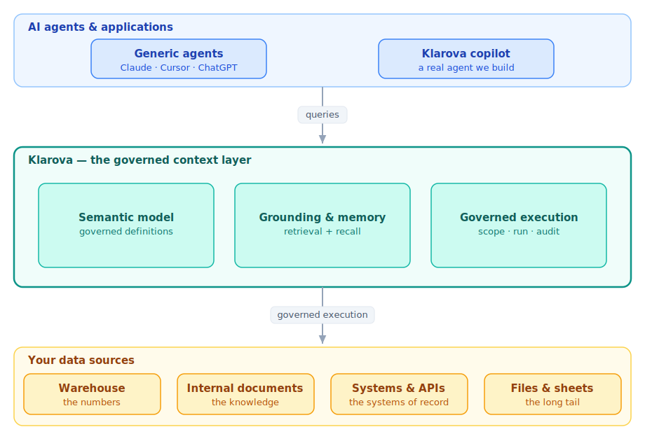

<div align="center">

# Klarova

### The trust layer between AI agents and your company's data.

Correct, cited, access-scoped answers — served to any agent over **MCP**.

[](https://github.com/samson-ailabs/Klarova/actions/workflows/ci.yml)
[](LICENSE)
[](pyproject.toml)
[](https://langchain-ai.github.io/langgraph/)

</div>

---

| ✅ **Correct** | 🔖 **Cited** | 🔒 **Scoped** |
| :-- | :-- | :-- |
| Grounded in governed definitions of what your numbers and terms actually mean. | Every answer traces to the exact query or source span it came from. | Every access is limited to what the asker is allowed to see — and audited. |

## The problem

A generic agent — Claude, Cursor, ChatGPT — can already plug into your database or document
store. But it doesn't understand *your* business, so it's **confidently wrong**: it writes
SQL that misreads your schema, answers from whatever it happened to retrieve, cites nothing,
and respects no rule about who may see which row or document. That's unshippable anywhere a
wrong number or a leaked row has real cost.

## The fix

**Klarova is a _governed context layer_ that sits between any agent and your data.** It does
no reasoning of its own — it's the trustworthy foundation an agent stands on. It holds your
governed definitions, the grounding that lets an agent query accurately, and governed
execution that scopes, runs, and audits every access. It's exposed over **MCP**, so *any*
agent gets the same correct, cited, scoped answer.

> **The agent is replaceable; the context layer is the moat.**

## ✨ What it does

- 🧠 **Semantic layer** — governed metric definitions, so an agent picks a metric *by name*
  instead of guessing the maths.
- 🗄️ **Text-to-SQL, governed** — validated read-only queries, executed and returned **with
  the exact SQL** that produced each number.
- 🔍 **Governed enterprise search** — hybrid (dense + sparse) retrieval over your documents,
  reranked and multi-hop, every answer **citing its source span**.
- 🔗 **Cross-source synthesis** — combine a governed warehouse number and a document fact
  into one answer that carries *both* citations.
- 🛡️ **Governed access** — identity-scoped rows and documents, enforced inside execution and
  written to an audit trail.
- 🔌 **MCP-native** — plug in Claude, Cursor, or Klarova's own copilot; all get the same
  governed result.
- 📊 **An evaluation harness** — every capability has an objective test (execution accuracy,
  retrieval recall, citation match), reported as a number.

## 🧩 How it works

Two things sit between a person and their data, and keeping them cleanly separate is the
whole design.

<p align="center">
  
</p>

- **The context layer (the moat)** — passive, reusable, MCP-exposed. A semantic model,
  grounding & memory, and governed execution. Does no reasoning.
- **The agent (the copilot)** — the reasoning consumer that turns a question into an answer
  by *consuming* the layer: plan → generate → execute → investigate → verify → synthesize →
  act → remember. Klarova ships its own reference copilot, but it sits in the same position
  as Claude or Cursor.

Because the layer holds no agent logic, **any** agent gets the same governed answers — which
is exactly why *it*, not the chat, is the durable asset.

## 🚀 Quickstart

> **Requirements:** Python 3.12+ and [`uv`](https://docs.astral.sh/uv/).

```bash
git clone git@github.com:samson-ailabs/Klarova.git
cd Klarova
uv sync                 # install dependencies into .venv
cp .env.example .env    # then add your OpenRouter + embedder keys
uv run klarova          # the development CLI/REPL
```

Development workflow:

```bash
uv run ruff check .     # lint
uv run ruff format .    # format
uv run mypy             # type-check (strict, src + tests)
uv run pytest           # tests
```

## 🗺️ Status & roadmap

> ⚠️ **Early stage** — the bootstrap is in place; the walking skeleton is next.

The build follows a **walking skeleton, then deepen** plan: the thinnest slice that *runs
and is measured* first, then one capability at a time, with every step leaving the system
running and re-measured.

**Vertical 1** grounds the layer over a **warehouse** (the numbers) and **internal
documents** (the knowledge), and across both. The same engine-core later serves other
domains (data-ops, CRM) by swapping connectors, not the core.

| Ship | Delivers | Milestone |
| :-- | :-- | :-- |
| **1** | the governed context layer (warehouse + docs) + eval report, over MCP | `v0.1` |
| **2** | the full reference copilot (investigate → verify → approve → act → remember) | `v0.2` |
| **3** | embedded in a host app + a public hosted demo | `v1.0` |

Full plan in [`docs/ROADMAP.md`](docs/ROADMAP.md) · design in
[`docs/ARCHITECTURE.md`](docs/ARCHITECTURE.md) · decisions in [`docs/decisions/`](docs/decisions/).

## 🛠️ Built with

Python 3.12+ · **LangChain / LangGraph v1** (primitives only) · DuckDB + sqlglot (governed
SQL) · Qdrant + FastEmbed (hybrid retrieval) · the official `mcp` SDK · OpenRouter (model
gateway) · ruff · mypy · pytest.

## 📄 License

[Apache-2.0](LICENSE). Every source file carries an SPDX header.
